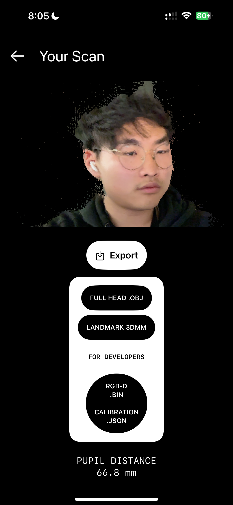

# OpticALLY-iOS
OpticALLY 3D Capture features an iOS app that can scan user's faces by leveraging iPhone's TrueDepth cameras, designed for bespoke eyeglasses.

<table><tr>

<td valign="center"></td>

<td valign="center"></td>

</tr></table>

---

## Troubleshooting Tips
If an error occurs where it says "Eigen/Core Not Found" on Xcode...

0. First, don't forget to set up Git submodules & LFS — it should prompt you a toast message on GitHub Desktop or CLI — just click 'yes'
1. Right click on "eigen-3.4.0" folder on the sidebar
2. Navigate to Finder, then copy and paste the folder in a separate folder like in Downloads or Documents
3. Right click & remove eigen-3.4.0 folder from sidebar, then drag and drop the backup eigen-3.4.0 on secondary folder (Downloads/Documents folder you copied and pasted before) to the root directory of the project again
4. Booyah! Problem solved.
